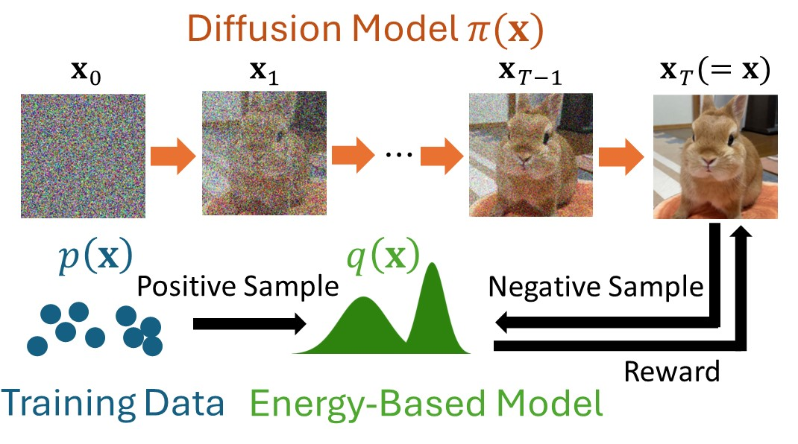

# Diffusion-by-MaxEntIRL

The official code release of  
**Maximum Entropy Inverse Reinforcement Learning of Diffusion Models with Energy-Based Models**

Sangwoong Yoon, Himchan Hwang, Dohyun Kwon, Yung-Kyun Noh, Frank C. Park   
arxiv: https://arxiv.org/abs/2407.00626



## Environment

* python >= 3.8
* pytorch >= 2.0
* cuda >= 11.6

## Unit tests

```
python -m pytest tests/
```

## TODO & Status

[] 2D  
[] CIFAR-10 DDPM 
    [] Training
    [] Generation
[] CIFAR-10 DDGAN
    [] Training
    [v] Generation
[] ImageNet64
    [] Training
    [] Generation
[] Anomaly Detection
[] FID Evaluation


## Datasets

```
datasets
├── cifar-10-batches-py
├── cifar10_train_png
├── cifar10_train_fid_stats.pt
├── imagenet  # corresponds to ILSVRC/Data/CLS-LOC/train
└── mvtec
    ├── train_data.pth
    └── val_data.pth
```

Dataset files are released in [dropbox link](https://www.dropbox.com/scl/fo/kk65utuwwirobbltha4oq/AFYUYYhqNZBq8FIr0VX8uPY?rlkey=vh90rf1o6vhsxmywbktsea3sf&dl=0)

**CIFAR-10**

**ImageNet 64x64**

**MVTec-AD**

## Model Checkpoints

Model checkpoints files can be found in [dropbox link](https://www.dropbox.com/scl/fo/hubdctq91m273eomviuvb/AOKLhw1gg50ljxOSMTla8Ko?rlkey=o5ixr0xdr05391ap2fwigzdkx&dl=0)


## Generation

**CIFAR-10**

Run `generate_cifar10.py` for unconditional CIFAR-10 generation. This script automatically loads the config and the checkpoint and generate images. 

The script also reports FID evaluated using `pytorch_fid` package. However, the FID scores reported in the paper are computed using Tensorflow code. (See Evaluation)

```
CUDA_VISIBLE_DEVICES=0,1,2,3 torchrun --nproc_per_node=4 generate_cifar10.py --log_dir pretrained/cifar10_ddpm_dxmi_T10 \
--stat datasets/cifar10_train_fid_stats.pt -n 50000
```

## Training


## Evaluation